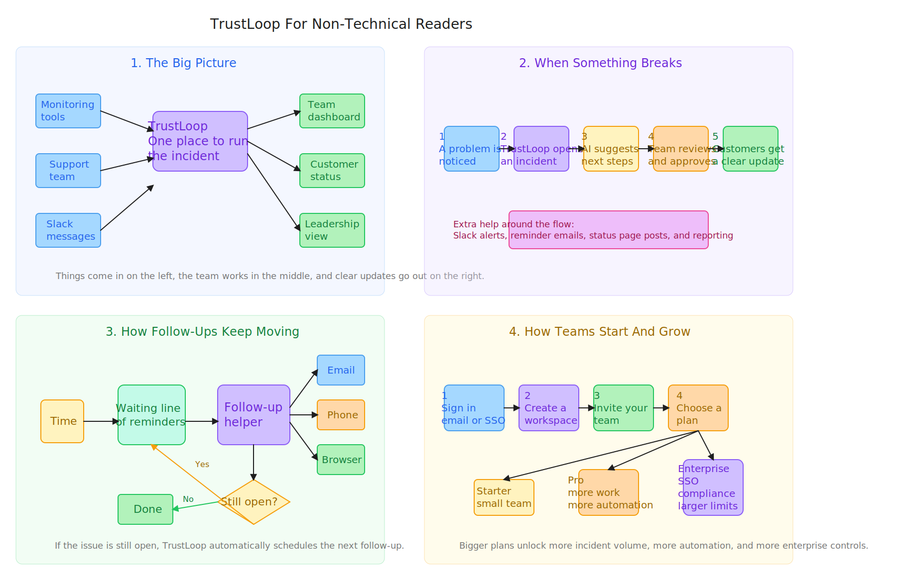
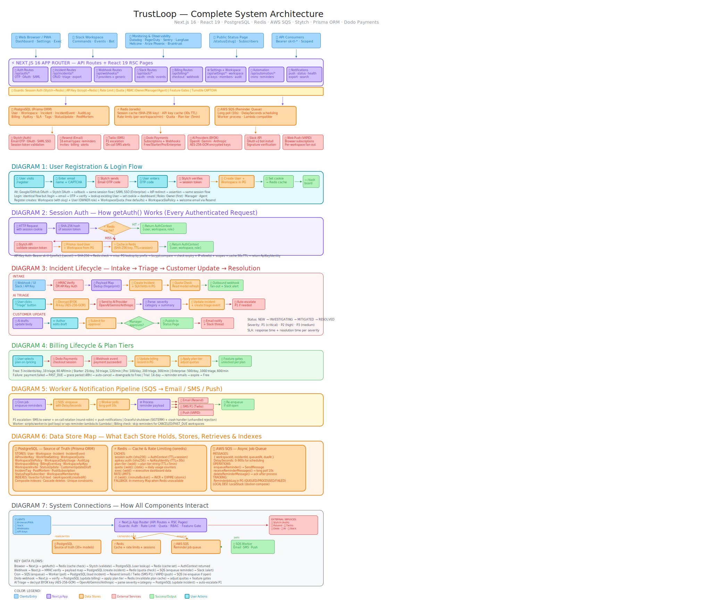

# TrustLoop

TrustLoop is an incident operations platform for AI product teams. It helps a workspace detect incidents, triage them with AI, coordinate internal responders, publish customer updates, and keep leadership informed from the same system.

## Architecture Diagrams

GitHub does not render `.excalidraw` files inline, so this repository includes SVG previews for both diagrams.

### High-Level System View



Source files:
- [TrustLoop-System-Design.excalidraw](./TrustLoop-System-Design.excalidraw)
- [docs/diagrams/trustloop-system-design.svg](./docs/diagrams/trustloop-system-design.svg)

### Detailed Architecture View



Source files:
- [TrustLoop-System-Design-detail.excalidraw](./TrustLoop-System-Design-detail.excalidraw)
- [docs/diagrams/trustloop-system-design-detail.svg](./docs/diagrams/trustloop-system-design-detail.svg)

## What TrustLoop Does

- Intake incidents from dashboards, support teams, Slack, and signed webhooks.
- Triage incidents with workspace-scoped AI keys across OpenAI, Gemini, and Anthropic.
- Draft customer-facing updates with approval controls and full audit history.
- Run reminder automation over SQS so incidents keep moving until they are resolved.
- Publish updates to the app, Slack, push notifications, email, and public status pages.
- Enforce plans, quotas, feature gates, and billing state per workspace.
- Provide executive reporting, exports, and operational visibility.

## How The Product Works

1. A signal comes in through the web app, Slack, or a webhook integration.
2. TrustLoop creates or updates an incident in the workspace.
3. The team reviews AI-assisted triage and customer update suggestions.
4. Reminder jobs and follow-ups are queued for async processing.
5. Customers, responders, and leadership receive updates through the right channel.

## Technology Stack

| Layer | Technology |
| --- | --- |
| Frontend | Next.js 16 App Router, React 19, Tailwind CSS 4 |
| Backend | Next.js route handlers, server components, TypeScript |
| Data | PostgreSQL, Prisma ORM |
| Cache and limits | Redis |
| Queue and workers | AWS SQS, `scripts/worker.ts` |
| Authentication | Stytch OTP, OAuth, SAML SSO |
| Notifications | Resend, Twilio, Web Push, Slack |
| Billing | Dodo Payments |
| Docs | Fumadocs at `/docs` |
| Testing | Vitest, Playwright |

## Repository Layout

| Path | Purpose |
| --- | --- |
| `src/app` | App Router pages, layouts, and API route handlers |
| `src/components` | Product UI, forms, panels, and marketing components |
| `src/lib` | Auth, incident services, billing, policy, queue, Slack, encryption, read models |
| `prisma` | Database schema and migrations |
| `scripts` | Local startup, workers, seeding, LocalStack setup, verification utilities |
| `content` | Documentation content used by the docs site |
| `docs/diagrams` | SVG previews generated from the Excalidraw architecture files |

## Quick Start

### Prerequisites

- Node.js 20+
- `pnpm` 10+
- PostgreSQL
- Redis
- Docker Desktop if you want LocalStack-backed SQS locally

### Fastest Local Setup

```bash
./start.sh
```

This installs dependencies and then runs the local bootstrap flow in `scripts/start-local.mjs`.

### Manual Local Setup

```bash
cp .env.example .env
pnpm install
docker compose -f docker-compose.localstack.yml up -d
pnpm prisma:generate
pnpm prisma:migrate
pnpm db:seed
pnpm localstack:init
pnpm dev:full
```

## Local URLs

| Surface | URL |
| --- | --- |
| App | `http://localhost:3000` |
| Login | `http://localhost:3000/login` |
| Register | `http://localhost:3000/register` |
| Dashboard | `http://localhost:3000/dashboard` |
| Executive view | `http://localhost:3000/executive` |
| Settings | `http://localhost:3000/settings` |
| Public status page | `http://localhost:3000/status/<workspace-slug>` |
| Docs | `http://localhost:3000/docs` |

## Configuration Overview

Start from [`.env.example`](./.env.example). The main configuration groups are:

- Core app: `NEXT_PUBLIC_APP_URL`, `DATABASE_URL`, `REDIS_URL`, `KEY_ENCRYPTION_SECRET`
- Auth: `STYTCH_PROJECT_ID`, `STYTCH_SECRET`, `STYTCH_PUBLIC_TOKEN`, `STYTCH_ENV`
- Notifications: `RESEND_API_KEY`, `RESEND_FROM_EMAIL`, `TWILIO_*`, `VAPID_*`
- Billing: `DODO_PAYMENTS_API_KEY`, `DODO_PAYMENTS_WEBHOOK_KEY`, product IDs
- Automation: cron secrets, reminder queue settings, LocalStack or AWS SQS values
- Integrations: Slack app credentials and any AI provider keys configured per workspace

## Important Commands

| Command | Description |
| --- | --- |
| `pnpm dev` | Start the web app |
| `pnpm dev:full` | Start the web app and worker together |
| `pnpm worker` | Run the reminder worker |
| `pnpm worker:once` | Run one worker cycle |
| `pnpm billing:grace:once` | Process billing grace-period automation once |
| `pnpm lint` | Run ESLint |
| `pnpm test` | Run unit and integration tests with Vitest |
| `pnpm test:e2e` | Run Playwright end-to-end tests |
| `pnpm build` | Create a production build |
| `pnpm prisma:migrate` | Run Prisma development migrations |
| `pnpm prisma:deploy` | Apply migrations in deploy-style environments |
| `pnpm db:seed` | Seed development data |
| `pnpm ai-keys:verify` | Check configured AI provider keys |

## Architecture Notes

- Request-time auth is handled through cookie sessions or scoped API keys, with Redis caching and Stytch validation behind `src/lib/auth.ts`, `src/lib/stytch.ts`, and `src/lib/api-key-auth.ts`.
- Incident intake and orchestration live in `src/app/api/incidents`, `src/lib/incident-service.ts`, `src/lib/webhook-intake.ts`, and `src/lib/webhook-mappers.ts`.
- Async follow-ups run through SQS and the worker in `scripts/worker.ts`, backed by `src/lib/queue.ts` and `src/lib/reminder-runner.ts`.
- Billing, policy, quotas, and plan enforcement are implemented in `src/lib/billing.ts`, `src/lib/billing-plan.ts`, `src/lib/policy.ts`, and the billing route handlers.
- Executive reporting and read models are assembled in `src/lib/read-models.ts` and surfaced in the dashboard and executive pages.

## Testing And Verification

Use the following commands before shipping backend or workflow changes:

```bash
pnpm lint
pnpm test
pnpm build
```

Run end-to-end coverage when you change flows that span auth, incident intake, or billing:

```bash
pnpm test:e2e
```

## Updating The Diagrams

Edit either `.excalidraw` source file, then regenerate the README previews:

```bash
node scripts/export-excalidraw-svg.mjs
```

That updates:

- `docs/diagrams/trustloop-system-design.svg`
- `docs/diagrams/trustloop-system-design-detail.svg`
